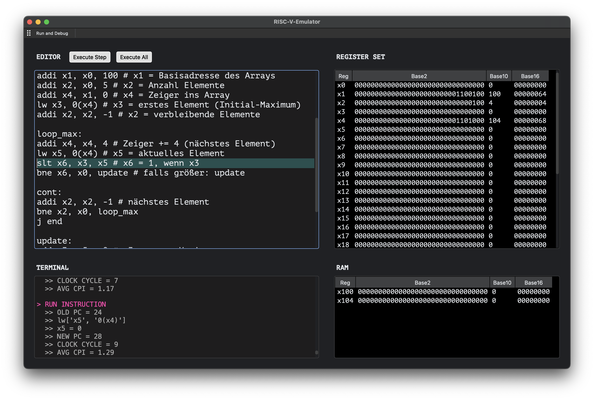
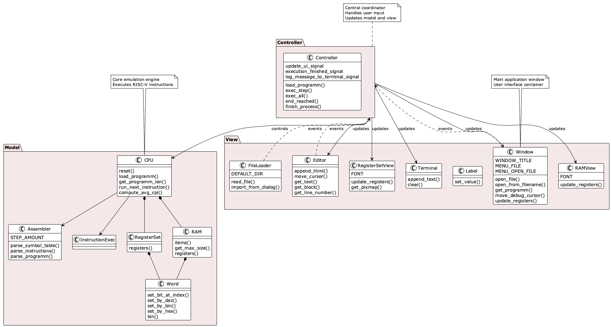

# RISC-V-Emulator



## Setup

Follow these steps to set up and run the RISC-V emulator on your machine.

### Prerequisites

This project is built and tested with **Python 3.12.2**. Verify your Python version:

```bash
# Check Python version
python3 --version  # macOS/Linux
python --version   # Windows
```

### Installation

#### 1. Clone the Repository 

```bash
# Skip if you already have the repository cloned
git clone https://github.com/michaelsthr/RISC-V-Emulator.git
# Navigate into the project directory
cd RISC-V-Emulator
```

#### 2. Set Up Virtual Environment

**macOS/Linux:**
```bash
python3 -m venv venv
source venv/bin/activate
```

**Windows:**
```bash
python -m venv venv
.\venv\Scripts\activate
```

> **Note for Windows users:** If you encounter script execution policy errors, you can either:
> - Run `Set-ExecutionPolicy -ExecutionPolicy RemoteSigned -Scope CurrentUser` in PowerShell
> - Or install packages globally without a virtual environment

#### 3. Install Dependencies

```bash
# macOS/Linux
pip3 install -r requirements.txt

# Windows
pip install -r requirements.txt
```

### Usage

```bash
# Run the emulator
python main.py
```

1. Click the *Examples* menu in the top bar to load built-in ASM examples, or select *File* to open your own assembly files (loaded files are copies; originals remain unchanged)
2. Click *Run & Debug* to start the emulator
3. Choose *Execute Step* to execute the current instruction one at a time, or *Execute All* to run the entire program
4. Enjoy exploring my RISC-V emulator ;)

## Working examples:

| Example | Status |
|---------|--------|
| example_1 | ✓ |
| example_2 | ✓ |
| example_3 | ✓ |
| example_4 | ✓ |
| example_5 | ✓ |
| example_6 | ✓ |
| example_7 | ✓ |
| example_8 | ✓ |
| example_9 | ✓ |
| **answer_to_life** | ✓ |

## Implemented instructions:

| Category | Instructions |
|----------|-------------|
| **Arithmetic** | `add`, `addi`, `sub`, `slt` |
| **Bitwise Logic** | `and`, `andi`, `or`, `ori`, `xor` |
| **Load Immediate** | `li`, `lui`, `auipc` |
| **Branch** | `beq`, `bne` |
| **Jump and Function** | `j`, `jal`, `jalr` |
| **Load and Store** | `lw`, `sw` |

## Included features:
- Implementation of a simple register file (32 registers, including x0)
- Main memory management (e.g., implemented as an array (ram.py or register_set.py) of **words**)
- Debug output (step by step or whole run)
- Memory dump (specific regions in RAM are shown if used)
- Interactive command line (step-by-step execution)
- Reading and parsing simple assembly programs as input
- Graphical visualization
- Performance estimation by assigning a CPI value to each instruction and summing up the required clock cycles for a program
There is no connection between the model and view, allowing for easy modification of either component without affecting the other.


## Documentation
- [RISC-V Instruction Set Manual](https://riscv.org/specifications/)
### Software Architecture

The RISC-V emulator is structured into several key components:
- model: Contains the core logic of the emulator, including the CPU and memory management.
- view: Handles the user interface, displaying the current state of the emulator and allowing user interaction
- controller: Manages the interaction between the model and view, processing user inputs and updating the model accordingly.

Importend files: 
- instruction_executor.py: Contains the logic of all RISC-V instructions.
- cpu.py: Contains the CPU class, which manages the state of the CPU, including registers and program counter.
- main.py: The entry point of the emulator, initializing the model, view, and controller.

To enhance readabilty, there is a custom word class, which handles every binary word.
The registers in register_set.py are a list of the word objects. Therefore it is easily possible to just add two words by
word + word, without pay attention of the bin/dez/hex conversasions

#### Class Diagram



### Known bugs:
- If the editor wraps the text, blocks not parsed well
- \n are sometimes not recognized
- doesnt stop if err in asm